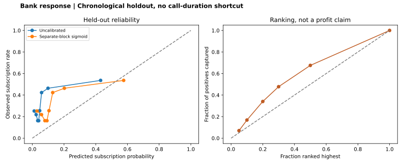

# Bank response: when the future distribution changes

By **[Ruturajsinh Zala (Root2Raj)](https://root2raj.ruturaj1zala123.chatgpt.site/about/)**. Root2Raj is my personal coding username. [Read the portfolio case study](https://root2raj.ruturaj1zala123.chatgpt.site/projects/bank-response-model/).

**Root2Raj · Data Science · AI-assisted historical model-risk case study**

Can campaign context rank subscription outcomes without using the duration of the call being predicted? This benchmark uses **41,188 real Portuguese bank campaign records**, ordered chronologically as documented by UCI. It deliberately examines a difficult later cohort rather than mixing earlier and later observations.

## Measured results on 8,238 later records

| Metric | Calibrated selected logistic model |
|---|---:|
| Average precision | 0.449 |
| ROC AUC | 0.648 |
| Brier score, lower is better | 0.240 |
| Subscription rate among top-ranked 10% | 51.82% |
| Lift vs test cohort prevalence | 1.68× |
| Share of positives captured in top 10% | 16.81% |

The observed positive rate moves from **4.81% in training to 30.83% in test**. Ranking has some signal, but these are modest discrimination results and substantial distribution shift. Calibration does not make the model deployment-ready. There is no claimed uplift, revenue or causal marketing effect.

## Design that prevents easy shortcuts

1. Preserve input order. Use 60% training, 10% model selection, 10% independent sigmoid calibration and the final 20% test. Exact per-block counts and positive rates are recorded.
2. Fit preprocessing on training only. Compare logistic regression and a constrained random forest with predeclared settings; select by model-selection average precision.
3. Freeze the winning model. Fit calibration only on the separate calibration block. Report raw and calibrated metrics on test without changing the model after seeing them.
4. Exclude current-call duration and all demographic/personal-financial variables. Exclude macroeconomic observations whose release timing is not established here. Use contact/campaign context only.
5. Export aggregate ranking and reliability tables. No individual customer features or predictions are published.

## Inspect and reproduce

[Run instructions](docs/REPRODUCIBILITY.md) · [Model card](docs/MODEL_CARD.md) · [Decision brief](docs/DECISION_BRIEF.md) · [Metrics](outputs/metrics.json) · [Calibration bins](outputs/calibration_bins.csv) · [Ranking curve](outputs/ranking_curve.csv) · [Validation](outputs/validation.json)

## Limits

The file supplies row order, not exact timestamps or customer IDs. Repeated contacts cannot be grouped by customer; independence and new-customer generalisation are unproven. Month/day/contact and campaign-count fields assume the intended contact context is known; operational availability still needs validation. Excluding demographics does not prove fairness. A retrospective top-ranked cohort is not a simulated randomized marketing intervention or evidence of profit. Do not deploy this model for customer decisions.

Developed with AI assistance as portfolio work; no bank relationship or professional deployment is claimed.

## Source

Moro, S., Rita, P., & Cortez, P. (2014). [Bank Marketing, UCI](https://archive.ics.uci.edu/dataset/222/bank+marketing). DOI [10.24432/C5K306](https://doi.org/10.24432/C5K306). CC BY 4.0. This project uses `bank-additional-full.csv`, not the 45,211-row older file. Code: MIT.
